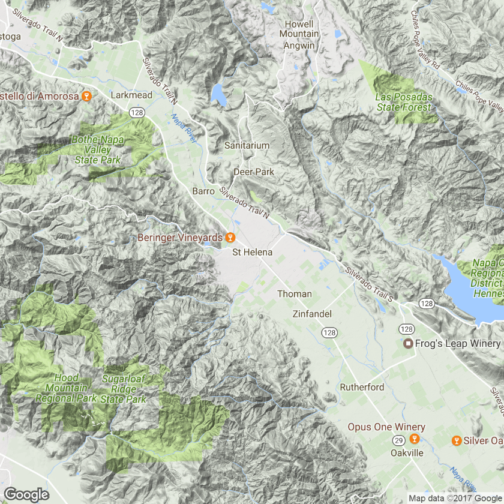
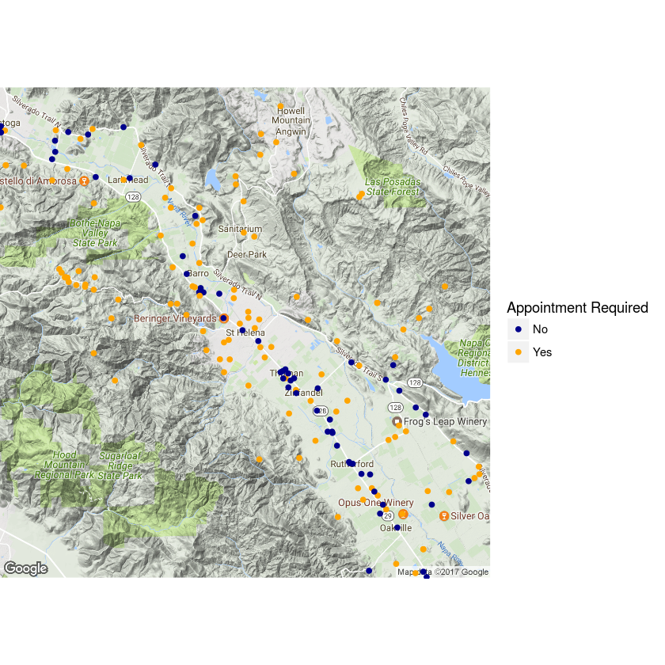

I wanted to try out the ggmap package, so I thought it would be fun to try and solve a problem that's 
been bugging me for a while: it's hard to find a good map of wineries you can visit in Napa Valley. 
(Yes, first-world problems, I know.) While there are more than 400 wineries in the Valley (plus 
hundreds more garage-based and custom crush producers), you can't visit all of them for a public 
tasting. The Napa Valley Wine project manages a database of all the wineries and notes which can 
be visited, but doesn't provide a map. 
I decided to use ggmap to create one.


```R
## David Smith - Revolution Analytics
## http://blog.revolutionanalytics.com/2012/07/making-beautiful-maps-in-r-with-ggmap.html
##
##################################################

require(ggmap)
require(mapproj)

## source data from: http://www.napawineproject.com/project-notes/index.asp
## Excel file exported as CSV with header rows removed

wine <- read.csv("https://raw.githubusercontent.com/paladin74/thesis/master/Napa-Winery-List62012.csv", stringsAsFactors=FALSE)
nwines <- nrow(wine)

```


```R
# wineries that accept tastings, either by appointment or walk-ins
tasting <- wine$App=="No" | wine$App=="Yes"
# sum(tasting)
# wine$Address[tasting]

# wineries with valid addresses (P.O. Boxes not counted as valid)
good.address <- wine$Address != ""
good.address[grep("Box", wine$Address)] <- F
# wine$Address[!good.address]
```


```R
# wineries you can visit to taste
visit <- good.address & tasting
# sum(visit) # 354 total

## filter data frame to visitable wineries
visit.wine <- wine[visit,]

```


```R

## paste address fields into a single CA address for geocoding
addresses <- with(visit.wine, 
 paste(Address, City, "CA", sep=", ")
)
```


```R
## some non-ASCII characters in source data will mess up geocoding
addresses <- iconv(addresses, to="ASCII",sub="")

## convert addresses to lat/long
# locs <- geocode(addresses)
# I got a "there is no connection 3" error when trying to do all at once, so breaking up into batches

```


```R
loc1 <- geocode(addresses[1:100])
loc2 <- geocode(addresses[101:200])
loc3 <- geocode(addresses[201:300])
loc4 <- geocode(addresses[301:345])
locs <- rbind(loc1, loc2, loc3, loc4)

visit.wine$lon <- locs$lon
visit.wine$lat <- locs$lat

```

    Information from URL : http://maps.googleapis.com/maps/api/geocode/json?address=2750%20Las%20Amigas%20Road,%20Napa,%20CA&sensor=false
    Information from URL : http://maps.googleapis.com/maps/api/geocode/json?address=7227%20Pope%20Valley%20Road???%20,%20Pope%20Valley,%20CA&sensor=false
    Information from URL : http://maps.googleapis.com/maps/api/geocode/json?address=3244%20Elhlers%20Lane,%20St.%20Helena,%20CA&sensor=false
    Information from URL : http://maps.googleapis.com/maps/api/geocode/json?address=Hwy%2029%20at%201155%20Mee%20Lane%20,%20Rutherford,%20CA&sensor=false
    Information from URL : http://maps.googleapis.com/maps/api/geocode/json?address=1700%20Wooden%20Valley%20Road,%20Napa,%20CA&sensor=false
    Information from URL : http://maps.googleapis.com/maps/api/geocode/json?address=4380%20Dale%20Drive,%20Napa,%20CA&sensor=false
    Information from URL : http://maps.googleapis.com/maps/api/geocode/json?address=1339%20Pearl%20St.%20Suite%20#201,%20Napa,%20CA&sensor=false
    Information from URL : http://maps.googleapis.com/maps/api/geocode/json?address=1099%20Greenfield%20Rd,%20St.%20Helena,%20CA&sensor=false
    Information from URL : http://maps.googleapis.com/maps/api/geocode/json?address=4047%20E.%20Third%20Ave,%20Napa,%20CA&sensor=false
    Information from URL : http://maps.googleapis.com/maps/api/geocode/json?address=680%20Rossi%20Road,%20St.%20Helena,%20CA&sensor=false
    .Information from URL : http://maps.googleapis.com/maps/api/geocode/json?address=4011%20Spring%20Mountain%20Road,%20St.%20Helena,%20CA&sensor=false
    .Information from URL : http://maps.googleapis.com/maps/api/geocode/json?address=4162%20Big%20Ranch%20Road%20,%20Napa,%20CA&sensor=false
    .Information from URL : http://maps.googleapis.com/maps/api/geocode/json?address=836%20Chiles%20Avenue,%20St.%20Helena,%20CA&sensor=false
    Information from URL : http://maps.googleapis.com/maps/api/geocode/json?address=742%20Sunnyside%20Road,%20St.%20Helena,%20CA&sensor=false
    Information from URL : http://maps.googleapis.com/maps/api/geocode/json?address=1455%20Inglewood%20Avenue%20,%20St.%20Helena,%20CA&sensor=false
    Information from URL : http://maps.googleapis.com/maps/api/geocode/json?address=110%20Camino%20Oruga,%20Napa,%20CA&sensor=false
    .Information from URL : http://maps.googleapis.com/maps/api/geocode/json?address=1345%20Henry%20Road%20,%20Napa,%20CA&sensor=false
    Information from URL : http://maps.googleapis.com/maps/api/geocode/json?address=3299%20Bennett%20Lane%20,%20Calistoga,%20CA&sensor=false
    Information from URL : http://maps.googleapis.com/maps/api/geocode/json?address=3700%20Soda%20Canyon%20Road%20,%20Napa,%20CA&sensor=false
    Information from URL : http://maps.googleapis.com/maps/api/geocode/json?address=1307-B%20Lincoln%20Avenue,%20Calistoga,%20CA&sensor=false
    .Information from URL : http://maps.googleapis.com/maps/api/geocode/json?address=4301%20Azalea%20Springs%20Way,%20Calistoga,%20CA&sensor=false
    .Information from URL : http://maps.googleapis.com/maps/api/geocode/json?address=6236%20Silverado%20Trail,%20Yountville,%20CA&sensor=false
    .Information from URL : http://maps.googleapis.com/maps/api/geocode/json?address=2820%20St.%20Helena%20Highway%20N,%20St.%20Helena,%20CA&sensor=false
    Information from URL : http://maps.googleapis.com/maps/api/geocode/json?address=4411%20Silverado%20Trail%20,%20Calistoga,%20CA&sensor=false
    Information from URL : http://maps.googleapis.com/maps/api/geocode/json?address=4070%20Spring%20Mountain%20Road%20,%20St.%20Helena,%20CA&sensor=false
    Information from URL : http://maps.googleapis.com/maps/api/geocode/json?address=1960%20St.%20Helena%20Highway%20,%20Rutherford,%20CA&sensor=false
    .Information from URL : http://maps.googleapis.com/maps/api/geocode/json?address=6200%20Washington%20Street,%20Yountville,%20CA&sensor=false
    Information from URL : http://maps.googleapis.com/maps/api/geocode/json?address=1010%20Big%20Tree%20Road,%20St.%20Helena,%20CA&sensor=false
    Information from URL : http://maps.googleapis.com/maps/api/geocode/json?address=3340%20Highway%20128%20,%20Calistoga,%20CA&sensor=false
    Information from URL : http://maps.googleapis.com/maps/api/geocode/json?address=2000%20Main%20St%20,%20St.%20Helena,%20CA&sensor=false
    Information from URL : http://maps.googleapis.com/maps/api/geocode/json?address=4088%20Atlas%20Peak%20Road,%20Napa,%20CA&sensor=false
    .Information from URL : http://maps.googleapis.com/maps/api/geocode/json?address=3105%20Silverado%20Trail,%20Napa,%20CA&sensor=false
    .Information from URL : http://maps.googleapis.com/maps/api/geocode/json?address=1075%20Shadybrook%20Lane,%20Napa,%20CA&sensor=false
    Information from URL : http://maps.googleapis.com/maps/api/geocode/json?address=4089%20Silverado%20Trail,%20Napa,%20CA&sensor=false
    Information from URL : http://maps.googleapis.com/maps/api/geocode/json?address=3277%20Dry%20Creek%20Road,%20Napa,%20CA&sensor=false
    Information from URL : http://maps.googleapis.com/maps/api/geocode/json?address=1075%20Buchli%20Station%20Road%20,%20Napa,%20CA&sensor=false
    .Information from URL : http://maps.googleapis.com/maps/api/geocode/json?address=975%20First%20Street,%20Napa,%20CA&sensor=false
    Information from URL : http://maps.googleapis.com/maps/api/geocode/json?address=190%20Camino%20Oruga%20Ste.%205,%20Napa,%20CA&sensor=false
    Information from URL : http://maps.googleapis.com/maps/api/geocode/json?address=4042%20Big%20Ranch%20Road,%20Napa,%20CA&sensor=false
    Information from URL : http://maps.googleapis.com/maps/api/geocode/json?address=330%20Stone%20Ridge%20Road,%20Angwin,%20CA&sensor=false
    Information from URL : http://maps.googleapis.com/maps/api/geocode/json?address=975%20Deer%20Park%20Road%20,%20St.%20Helena,%20CA&sensor=false
    .Information from URL : http://maps.googleapis.com/maps/api/geocode/json?address=820%20Greenfield%20Road%20,%20St.%20Helena,%20CA&sensor=false
    .Information from URL : http://maps.googleapis.com/maps/api/geocode/json?address=1108%20Deer%20Park%20Road%20,%20St.%20Helena,%20CA&sensor=false
    Information from URL : http://maps.googleapis.com/maps/api/geocode/json?address=2515%20Napa%20Valley%20Corp.%20Dr,%20Napa,%20CA&sensor=false
    Information from URL : http://maps.googleapis.com/maps/api/geocode/json?address=360%20Howell%20Mountain%20Road,%20Angwin,%20CA&sensor=false
    Information from URL : http://maps.googleapis.com/maps/api/geocode/json?address=Winery%20Address%20N/A,%20St.%20Helena,%20CA&sensor=false
    .Information from URL : http://maps.googleapis.com/maps/api/geocode/json?address=3800%20Langtry%20Road%20,%20St.%20Helena,%20CA&sensor=false
    Information from URL : http://maps.googleapis.com/maps/api/geocode/json?address=8300%20St.%20Helena%20Highway%20,%20Rutherford,%20CA&sensor=false
    Information from URL : http://maps.googleapis.com/maps/api/geocode/json?address=629%20Fulton%20Lane,%20St.%20Helena,%20CA&sensor=false
    Information from URL : http://maps.googleapis.com/maps/api/geocode/json?address=270%20Kruezer%20Lane,%20Napa,%20CA&sensor=false
    Information from URL : http://maps.googleapis.com/maps/api/geocode/json?address=Silverado%20Trail,%20Calistoga,%20CA&sensor=false
    .Information from URL : http://maps.googleapis.com/maps/api/geocode/json?address=Main%20Street,%20St.%20Helena,%20CA&sensor=false
    .Information from URL : http://maps.googleapis.com/maps/api/geocode/json?address=1016%20Dunaweal%20Lane,%20Calistoga,%20CA&sensor=false
    Information from URL : http://maps.googleapis.com/maps/api/geocode/json?address=7600%20St.%20Helena%20Highway%20,%20Oakville,%20CA&sensor=false
    Information from URL : http://maps.googleapis.com/maps/api/geocode/json?address=1170%20Tubbs%20Lane,%20Calistoga,%20CA&sensor=false
    .Information from URL : http://maps.googleapis.com/maps/api/geocode/json?address=205%20Jim%20Oswald%20Way%20#B,%20A.%20Canyon,%20CA&sensor=false
    .Information from URL : http://maps.googleapis.com/maps/api/geocode/json?address=3451%20Silverado%20Trail%20,%20St.%20Helena,%20CA&sensor=false
    Information from URL : http://maps.googleapis.com/maps/api/geocode/json?address=4045%20North%20St%20Helena%20Hwy%20,%20Calistoga,%20CA&sensor=false
    Information from URL : http://maps.googleapis.com/maps/api/geocode/json?address=8700%20Conn%20Creek%20Road,%20Rutherford,%20CA&sensor=false
    Information from URL : http://maps.googleapis.com/maps/api/geocode/json?address=1016%20Las%20Amigas%20Road%20,%20Napa,%20CA&sensor=false
    Information from URL : http://maps.googleapis.com/maps/api/geocode/json?address=1330%20Sylvaner%20Ave,%20St.%20Helena,%20CA&sensor=false
    Information from URL : http://maps.googleapis.com/maps/api/geocode/json?address=1581%20Sage%20Canyon%20Road,%20St.%20Helena,%20CA&sensor=false
    .Information from URL : http://maps.googleapis.com/maps/api/geocode/json?address=2800%20Main%20Street,%20St.%20Helena,%20CA&sensor=false
    Information from URL : http://maps.googleapis.com/maps/api/geocode/json?address=1636%20Scott%20Street,%20St.%20Helena,%20CA&sensor=false
    Information from URL : http://maps.googleapis.com/maps/api/geocode/json?address=2252%20Sulphur%20Springs,%20St.%20Helena,%20CA&sensor=false
    .Information from URL : http://maps.googleapis.com/maps/api/geocode/json?address=3468%20Silverado%20Trail,%20St.%20Helena,%20CA&sensor=false
    .Information from URL : http://maps.googleapis.com/maps/api/geocode/json?address=1429%20Tubbs%20Lane%20,%20Calistoga,%20CA&sensor=false
    Information from URL : http://maps.googleapis.com/maps/api/geocode/json?address=975%20Washington%20Street,%20Napa,%20CA&sensor=false
    Information from URL : http://maps.googleapis.com/maps/api/geocode/json?address=5350%20Silverado%20Trail%20,%20Napa,%20CA&sensor=false
    Information from URL : http://maps.googleapis.com/maps/api/geocode/json?address=6307%20Pope%20Valley%20Road,%20Pope%20Valley,%20CA&sensor=false
    Information from URL : http://maps.googleapis.com/maps/api/geocode/json?address=1473%20Yountville%20Cross%20Road%20,%20Yountville,%20CA&sensor=false
    Information from URL : http://maps.googleapis.com/maps/api/geocode/json?address=5330%20Silverado%20Trail?%20,%20Napa,%20CA&sensor=false
    .Information from URL : http://maps.googleapis.com/maps/api/geocode/json?address=1060%20Dunaweal%20Lane%20,%20Calistoga,%20CA&sensor=false
    Information from URL : http://maps.googleapis.com/maps/api/geocode/json?address=8711%20Silverado%20Trail%20,%20St.%20Helena,%20CA&sensor=false
    Information from URL : http://maps.googleapis.com/maps/api/geocode/json?address=2121%20Diamond%20Mountain%20Rd,%20Calistoga,%20CA&sensor=false
    .Information from URL : http://maps.googleapis.com/maps/api/geocode/json?address=987%20St.%20Helena%20Highway,%20St.%20Helena,%20CA&sensor=false
    .Information from URL : http://maps.googleapis.com/maps/api/geocode/json?address=7415%20St.%20Helena%20Highway%20,%20Yountville,%20CA&sensor=false
    Information from URL : http://maps.googleapis.com/maps/api/geocode/json?address=1832%20Soscal%20Ave%20Suite%20115,%20Napa,%20CA&sensor=false
    Information from URL : http://maps.googleapis.com/maps/api/geocode/json?address=1221%20Duhig%20Road%20,%20Napa,%20CA&sensor=false
    Information from URL : http://maps.googleapis.com/maps/api/geocode/json?address=4550%20Silverado%20Trail%20N,%20St.%20Helena,%20CA&sensor=false
    Information from URL : http://maps.googleapis.com/maps/api/geocode/json?address=1860%20Howell%20Mountain%20Rd,%20St.%20Helena,%20CA&sensor=false
    Information from URL : http://maps.googleapis.com/maps/api/geocode/json?address=4240%20Silverado%20Trail%20,%20Napa,%20CA&sensor=false
    Information from URL : http://maps.googleapis.com/maps/api/geocode/json?address=1521%20Sage%20Canyon%20Road,%20St.%20Helena,%20CA&sensor=false
    .Information from URL : http://maps.googleapis.com/maps/api/geocode/json?address=825%20Fulton%20Lane,%20St.%20Helena,%20CA&sensor=false
    Information from URL : http://maps.googleapis.com/maps/api/geocode/json?address=1333%20Bella%20Oaks%20Lane,%20Napa,%20CA&sensor=false
    .Information from URL : http://maps.googleapis.com/maps/api/geocode/json?address=1445%20Highway%2029,%20St.%20Helena,%20CA&sensor=false
    .Information from URL : http://maps.googleapis.com/maps/api/geocode/json?address=11055%20Atlas%20Peak%20Road,%20Napa,%20CA&sensor=false
    Information from URL : http://maps.googleapis.com/maps/api/geocode/json?address=908%20Enterprise%20Way%20#C,%20Napa,%20CA&sensor=false
    Information from URL : http://maps.googleapis.com/maps/api/geocode/json?address=1595%20Oakville%20Grade,%20Oakville,%20CA&sensor=false
    Information from URL : http://maps.googleapis.com/maps/api/geocode/json?address=1391%20Diamond%20Mtn.%20Road,%20Calistoga,%20CA&sensor=false
    Information from URL : http://maps.googleapis.com/maps/api/geocode/json?address=1%20California%20Drive,%20Yountville,%20CA&sensor=false
    Information from URL : http://maps.googleapis.com/maps/api/geocode/json?address=4001%20Spring%20Mountain%20Road,%20St.%20Helena,%20CA&sensor=false
    Information from URL : http://maps.googleapis.com/maps/api/geocode/json?address=1240%20Duhig%20Rd,%20Napa,%20CA&sensor=false
    Information from URL : http://maps.googleapis.com/maps/api/geocode/json?address=Trancas%20Ave,%20Napa,%20CA&sensor=false
    Information from URL : http://maps.googleapis.com/maps/api/geocode/json?address=1000%20Lodi%20Lane,%20Calistoga,%20CA&sensor=false
    .Information from URL : http://maps.googleapis.com/maps/api/geocode/json?address=4310%20Silverado%20Trail,%20Calistoga,%20CA&sensor=false
    .Information from URL : http://maps.googleapis.com/maps/api/geocode/json?address=1844%20Pope%20Canyon%20Road,%20Pope%20Valley,%20CA&sensor=false
    .Information from URL : http://maps.googleapis.com/maps/api/geocode/json?address=680%20Rossi%20Road,%20St.%20Helena,%20CA&sensor=false
    .Information from URL : http://maps.googleapis.com/maps/api/geocode/json?address=3222%20Ehlers%20Lane%20,%20St.%20Helena,%20CA&sensor=false
    Information from URL : http://maps.googleapis.com/maps/api/geocode/json?address=3781%20Silverado%20Trail,%20St.%20Helena,%20CA&sensor=false
    Information from URL : http://maps.googleapis.com/maps/api/geocode/json?address=4500%20Atlas%20Peak%20Road,%20Napa,%20CA&sensor=false
    Information from URL : http://maps.googleapis.com/maps/api/geocode/json?address=1165%20Rutherford%20Road%20,%20Rutherford,%20CA&sensor=false
    Information from URL : http://maps.googleapis.com/maps/api/geocode/json?address=200%20Polson%20Road,%20Napa,%20CA&sensor=false
    Information from URL : http://maps.googleapis.com/maps/api/geocode/json?address=2100%20Hoffman%20Lane,%20Napa,%20CA&sensor=false
    Information from URL : http://maps.googleapis.com/maps/api/geocode/json?address=1170%20Tubbs%20Lane,%20Calistoga,%20CA&sensor=false
    .Information from URL : http://maps.googleapis.com/maps/api/geocode/json?address=4078%20Spring%20Mountain%20Rd.,%20St.%20Helena,%20CA&sensor=false
    .Information from URL : http://maps.googleapis.com/maps/api/geocode/json?address=1250%20Cuttings%20Wharf%20Road,%20Napa,%20CA&sensor=false
    .Information from URL : http://maps.googleapis.com/maps/api/geocode/json?address=3530%20Silverado%20Trail,%20St.%20Helena,%20CA&sensor=false
    .Information from URL : http://maps.googleapis.com/maps/api/geocode/json?address=1606%20Main%20Street%20#206,%20Napa,%20CA&sensor=false
    Information from URL : http://maps.googleapis.com/maps/api/geocode/json?address=1350%20Acacia%20Drive%20,%20Oakville,%20CA&sensor=false
    Information from URL : http://maps.googleapis.com/maps/api/geocode/json?address=2222%20North%20Third%20Avenue%20,%20Napa,%20CA&sensor=false
    Information from URL : http://maps.googleapis.com/maps/api/geocode/json?address=270%20Kruezer%20Lane,%20Napa,%20CA&sensor=false
    Information from URL : http://maps.googleapis.com/maps/api/geocode/json?address=950%20Galleron%20Lane%20,%20Rutherford,%20CA&sensor=false
    Information from URL : http://maps.googleapis.com/maps/api/geocode/json?address=1978%20West%20Zinfandel%20Lane,%20St.%20Helena,%20CA&sensor=false
    Information from URL : http://maps.googleapis.com/maps/api/geocode/json?address=677%20S.%20St.%20Helena%20Hwy,%20St.%20Helena,%20CA&sensor=false
    .Information from URL : http://maps.googleapis.com/maps/api/geocode/json?address=1600%20Aetna%20Springs%20Road,%20Pope%20Valley,%20CA&sensor=false
    .Information from URL : http://maps.googleapis.com/maps/api/geocode/json?address=7481%20St.%20Helena%20Highway%20,%20Oakville,%20CA&sensor=false
    .Information from URL : http://maps.googleapis.com/maps/api/geocode/json?address=1285%20Dealy%20Lane,%20Napa,%20CA&sensor=false
    .Information from URL : http://maps.googleapis.com/maps/api/geocode/json?address=1721%20Partrick%20Road,%20Napa,%20CA&sensor=false
    Information from URL : http://maps.googleapis.com/maps/api/geocode/json?address=1501%20Big%20Rock%20Road,%20St.%20Helena,%20CA&sensor=false
    Information from URL : http://maps.googleapis.com/maps/api/geocode/json?address=1178%20Galleron%20Road%20,%20St.%20Helena,%20CA&sensor=false
    Information from URL : http://maps.googleapis.com/maps/api/geocode/json?address=1091%20Larkmead%20Lane%20,%20Calistoga,%20CA&sensor=false
    Information from URL : http://maps.googleapis.com/maps/api/geocode/json?address=2055%20Hoffman%20Lane,%20Yountville,%20CA&sensor=false
    Information from URL : http://maps.googleapis.com/maps/api/geocode/json?address=70%20Rapp%20Lane,%20Napa,%20CA&sensor=false
    Information from URL : http://maps.googleapis.com/maps/api/geocode/json?address=3022%20St%20Helena%20Highway%20N,%20St.%20Helena,%20CA&sensor=false
    .Information from URL : http://maps.googleapis.com/maps/api/geocode/json?address=3125%20North%20St.%20Helena%20Hwy,%20St.%20Helena,%20CA&sensor=false
    Information from URL : http://maps.googleapis.com/maps/api/geocode/json?address=8815%20Conn%20Creek%20Road,%20Rutherford,%20CA&sensor=false
    .Information from URL : http://maps.googleapis.com/maps/api/geocode/json?address=1535%20Sage%20Canyon%20Road,%20St.%20Helena,%20CA&sensor=false
    .Information from URL : http://maps.googleapis.com/maps/api/geocode/json?address=575%20Oakville%20Crossroad,%20Napa,%20CA&sensor=false
    Information from URL : http://maps.googleapis.com/maps/api/geocode/json?address=6795%20Washington%20Street,%20Yountville,%20CA&sensor=false
    Information from URL : http://maps.googleapis.com/maps/api/geocode/json?address=3655%20Mount%20Veeder%20Rd,%20Napa,%20CA&sensor=false
    Information from URL : http://maps.googleapis.com/maps/api/geocode/json?address=1119%20State%20Lane,%20Yountville,%20CA&sensor=false
    Information from URL : http://maps.googleapis.com/maps/api/geocode/json?address=1829%20St.%20Helena%20Highway%20,%20Rutherford,%20CA&sensor=false
    Information from URL : http://maps.googleapis.com/maps/api/geocode/json?address=750%20Oakville%20Cross%20Road,%20Oakville,%20CA&sensor=false
    Information from URL : http://maps.googleapis.com/maps/api/geocode/json?address=3851%20Spring%20Mountain%20Rd,%20St.%20Helena,%20CA&sensor=false
    .Information from URL : http://maps.googleapis.com/maps/api/geocode/json?address=1146%20First%20St,%20Napa,%20CA&sensor=false
    Information from URL : http://maps.googleapis.com/maps/api/geocode/json?address=4160%20Silverado%20Trail%20,%20Napa,%20CA&sensor=false
    .Information from URL : http://maps.googleapis.com/maps/api/geocode/json?address=401%20St.%20Helena%20Highway%20S,%20St.%20Helena,%20CA&sensor=false
    .Information from URL : http://maps.googleapis.com/maps/api/geocode/json?address=56%20Auberge%20Road,%20Rutherford,%20CA&sensor=false
    Information from URL : http://maps.googleapis.com/maps/api/geocode/json?address=5795%20Silverado%20Trail,%20Napa,%20CA&sensor=false
    .Information from URL : http://maps.googleapis.com/maps/api/geocode/json?address=588%20Trancas%20Street,%20Napa,%20CA&sensor=false
    Information from URL : http://maps.googleapis.com/maps/api/geocode/json?address=1241%20Adams%20St.%20#1043,%20St.%20Helena,%20CA&sensor=false
    Information from URL : http://maps.googleapis.com/maps/api/geocode/json?address=436%20St.%20Helena%20Highway%20S,%20St.%20Helena,%20CA&sensor=false
    Information from URL : http://maps.googleapis.com/maps/api/geocode/json?address=3500%20Highway%20128,%20Calistoga,%20CA&sensor=false
    Information from URL : http://maps.googleapis.com/maps/api/geocode/json?address=3104%20Redwood%20Road,%20Napa,%20CA&sensor=false
    .Information from URL : http://maps.googleapis.com/maps/api/geocode/json?address=4411%20Redwood%20Road,%20Napa,%20CA&sensor=false
    Information from URL : http://maps.googleapis.com/maps/api/geocode/json?address=6512%20Washington%20Street,%20Yountville,%20CA&sensor=false
    .Information from URL : http://maps.googleapis.com/maps/api/geocode/json?address=850%20Rutherford%20Road%20,%20Rutherford,%20CA&sensor=false
    .Information from URL : http://maps.googleapis.com/maps/api/geocode/json?address=6540%20Washington%20Street,%20Yountville,%20CA&sensor=false
    Information from URL : http://maps.googleapis.com/maps/api/geocode/json?address=6204%20Washington%20Street,%20Yountville,%20CA&sensor=false
    .Information from URL : http://maps.googleapis.com/maps/api/geocode/json?address=5225%20Solano%20Avenue,%20Napa,%20CA&sensor=false
    Information from URL : http://maps.googleapis.com/maps/api/geocode/json?address=1991%20St.%20Helena%20Highway,%20St.%20Helena,%20CA&sensor=false
    Information from URL : http://maps.googleapis.com/maps/api/geocode/json?address=6275%20Silverado%20Trail%20,%20Napa,%20CA&sensor=false
    Information from URL : http://maps.googleapis.com/maps/api/geocode/json?address=5014%20Silverado%20Trail,%20Napa,%20CA&sensor=false
    Information from URL : http://maps.googleapis.com/maps/api/geocode/json?address=2249%20James%20Creek%20Road,%20Pope%20Valley,%20CA&sensor=false
    Information from URL : http://maps.googleapis.com/maps/api/geocode/json?address=2970%20Monticello%20Rd,%20Napa,%20CA&sensor=false
    Information from URL : http://maps.googleapis.com/maps/api/geocode/json?address=3292%20Old%20Lawley%20Toll%20Road,%20Calistoga,%20CA&sensor=false
    .Information from URL : http://maps.googleapis.com/maps/api/geocode/json?address=6740%20Washington%20Street,%20Yountville,%20CA&sensor=false
    .Information from URL : http://maps.googleapis.com/maps/api/geocode/json?address=200%20Taplin%20Road,%20St.%20Helena,%20CA&sensor=false
    Information from URL : http://maps.googleapis.com/maps/api/geocode/json?address=2332%20Silverado%20Trail,%20Napa,%20CA&sensor=false
    .Information from URL : http://maps.googleapis.com/maps/api/geocode/json?address=2900%20Spring%20Mountain%20Rd,%20St.%20Helena,%20CA&sensor=false
    Information from URL : http://maps.googleapis.com/maps/api/geocode/json?address=1001%20State%20Lane,%20Yountville,%20CA&sensor=false
    Information from URL : http://maps.googleapis.com/maps/api/geocode/json?address=1250%20Las%20Posadas%20Road,%20Angwin,%20CA&sensor=false
    Information from URL : http://maps.googleapis.com/maps/api/geocode/json?address=360%20Zinfandel%20Lane,%20St.%20Helena,%20CA&sensor=false
    .Information from URL : http://maps.googleapis.com/maps/api/geocode/json?address=1094%20Hardman%20Ave,%20Napa,%20CA&sensor=false
    Information from URL : http://maps.googleapis.com/maps/api/geocode/json?address=3267%20Soda%20Canyon%20Road,%20Napa,%20CA&sensor=false
    Information from URL : http://maps.googleapis.com/maps/api/geocode/json?address=2470%20Sage%20Canyon%20Road,%20St.%20Helena,%20CA&sensor=false
    .Information from URL : http://maps.googleapis.com/maps/api/geocode/json?address=1102%20Las%20Posadas%20Road,%20Angwin,%20CA&sensor=false
    .Information from URL : http://maps.googleapis.com/maps/api/geocode/json?address=50%20White%20Cottage%20Road%20S,%20Angwin,%20CA&sensor=false
    Information from URL : http://maps.googleapis.com/maps/api/geocode/json?address=5055%20Solano%20Avenue,%20Napa,%20CA&sensor=false
    .Information from URL : http://maps.googleapis.com/maps/api/geocode/json?address=Summit%20Lake%20Drive,%20Angwin,%20CA&sensor=false
    Information from URL : http://maps.googleapis.com/maps/api/geocode/json?address=1100%20Larkmead%20Lane,%20Calistoga,%20CA&sensor=false
    Information from URL : http://maps.googleapis.com/maps/api/geocode/json?address=1245%20Main%20St,%20Napa,%20CA&sensor=false
    Information from URL : http://maps.googleapis.com/maps/api/geocode/json?address=4225%20Solano%20Ave%20Ste.%20633,%20Napa,%20CA&sensor=false
    .Information from URL : http://maps.googleapis.com/maps/api/geocode/json?address=410%20Lafata%20Street%20#203,%20St.%20Helena,%20CA&sensor=false
    Information from URL : http://maps.googleapis.com/maps/api/geocode/json?address=7600%20Saint%20Helena%20Hwy,%20Oakville,%20CA&sensor=false
    Information from URL : http://maps.googleapis.com/maps/api/geocode/json?address=1775%20Whitehall%20Lane,%20St.%20Helena,%20CA&sensor=false
    .Information from URL : http://maps.googleapis.com/maps/api/geocode/json?address=254%20South%20St.%20Helena%20Hwy,%20St.%20Helena,%20CA&sensor=false
    .Information from URL : http://maps.googleapis.com/maps/api/geocode/json?address=2921%20Silverado%20Trail,%20Napa,%20CA&sensor=false
    Information from URL : http://maps.googleapis.com/maps/api/geocode/json?address=5400%20Old%20Sonoma%20Road,%20Napa,%20CA&sensor=false
    Information from URL : http://maps.googleapis.com/maps/api/geocode/json?address=3718%20N%20St.%20Helena%20Highway,%20St.%20Helena,%20CA&sensor=false
    Information from URL : http://maps.googleapis.com/maps/api/geocode/json?address=708%201st%20Street,%20Napa,%20CA&sensor=false
    Information from URL : http://maps.googleapis.com/maps/api/geocode/json?address=3070%20Lawley-Old%20Toll%20Road,%20Calistoga,%20CA&sensor=false
    .Information from URL : http://maps.googleapis.com/maps/api/geocode/json?address=2812%20St.%20Helena%20Highway%20N,%20St.%20Helena,%20CA&sensor=false
    .Information from URL : http://maps.googleapis.com/maps/api/geocode/json?address=3600%20White%20Sulphur%20Springs%20Rd,%20St.%20Helena,%20CA&sensor=false
    Information from URL : http://maps.googleapis.com/maps/api/geocode/json?address=714%20First%20St,%20Napa,%20CA&sensor=false
    Information from URL : http://maps.googleapis.com/maps/api/geocode/json?address=1155%20Lokoya%20Road,%20Napa,%20CA&sensor=false
    Information from URL : http://maps.googleapis.com/maps/api/geocode/json?address=2530%20Las%20Amigas%20Road,%20Napa,%20CA&sensor=false
    .Information from URL : http://maps.googleapis.com/maps/api/geocode/json?address=1000%20Main%20St,%20St.%20Helena,%20CA&sensor=false
    Information from URL : http://maps.googleapis.com/maps/api/geocode/json?address=2993%20Brookwood%20Drive,%20Napa,%20CA&sensor=false
    Information from URL : http://maps.googleapis.com/maps/api/geocode/json?address=107%20Lilac%20Lane,%20St.%20Helena,%20CA&sensor=false
    Information from URL : http://maps.googleapis.com/maps/api/geocode/json?address=1091%20St.%20Helena%20Hwy.%20S,%20St.%20Helena,%20CA&sensor=false
    Information from URL : http://maps.googleapis.com/maps/api/geocode/json?address=7850%20Silverado%20Trail,%20Oakville,%20CA&sensor=false
    .Information from URL : http://maps.googleapis.com/maps/api/geocode/json?address=647%20Greenfield%20Road,%20St.%20Helena,%20CA&sensor=false
    .Information from URL : http://maps.googleapis.com/maps/api/geocode/json?address=5225%20Solano%20Avenue,%20Napa,%20CA&sensor=false
    .Information from URL : http://maps.googleapis.com/maps/api/geocode/json?address=1521%20Sage%20Canyon%20Road,%20St.%20Helena,%20CA&sensor=false
    Information from URL : http://maps.googleapis.com/maps/api/geocode/json?address=4242%20Big%20Ranch%20Road,%20Napa,%20CA&sensor=false
    Information from URL : http://maps.googleapis.com/maps/api/geocode/json?address=Rockland%20Road,%20St.%20Helena,%20CA&sensor=false
    .Information from URL : http://maps.googleapis.com/maps/api/geocode/json?address=6015%20Steele%20Canyon%20Road,%20Napa,%20CA&sensor=false
    Information from URL : http://maps.googleapis.com/maps/api/geocode/json?address=8445%20Silverado%20Trail,%20Napa,%20CA&sensor=false
    Information from URL : http://maps.googleapis.com/maps/api/geocode/json?address=2812%20St.%20Helena%20Highway%20N,%20St.%20Helena,%20CA&sensor=false
    .Information from URL : http://maps.googleapis.com/maps/api/geocode/json?address=1%20Executive%20Way,%20Napa,%20CA&sensor=false
    Information from URL : http://maps.googleapis.com/maps/api/geocode/json?address=2277%20Napa%20Vallejo%20Highway,%20Napa,%20CA&sensor=false
    .Information from URL : http://maps.googleapis.com/maps/api/geocode/json?address=7830-40%20St.%20Helena%20Hwy,%20Oakville,%20CA&sensor=false
    .Information from URL : http://maps.googleapis.com/maps/api/geocode/json?address=716%20Liparita%20Road,%20Angwin,%20CA&sensor=false
    .Information from URL : http://maps.googleapis.com/maps/api/geocode/json?address=2555%20Madrona%20Ave,%20St.%20Helena,%20CA&sensor=false
    Information from URL : http://maps.googleapis.com/maps/api/geocode/json?address=2153%20Sage%20Canyon%20Road,%20St.%20Helena,%20CA&sensor=false
    Information from URL : http://maps.googleapis.com/maps/api/geocode/json?address=8164%20St.%20Helena%20Highway%20,%20Oakville,%20CA&sensor=false
    Information from URL : http://maps.googleapis.com/maps/api/geocode/json?address=7781%20Silverado%20Trail,%20Oakville,%20CA&sensor=false
    Information from URL : http://maps.googleapis.com/maps/api/geocode/json?address=1200%20Orchard%20Ave,%20Napa,%20CA&sensor=false
    Information from URL : http://maps.googleapis.com/maps/api/geocode/json?address=974%20Lincoln%20Street,%20Napa,%20CA&sensor=false
    .Information from URL : http://maps.googleapis.com/maps/api/geocode/json?address=1255%20Lincoln%20Ave,%20Calistoga,%20CA&sensor=false
    Information from URL : http://maps.googleapis.com/maps/api/geocode/json?address=7900%20St.%20Helena%20Highway,%20Oakville,%20CA&sensor=false
    .Information from URL : http://maps.googleapis.com/maps/api/geocode/json?address=116%20E.%20First%20Street,%20Napa,%20CA&sensor=false
    .Information from URL : http://maps.googleapis.com/maps/api/geocode/json?address=Call%20for%20directions,%20Angwin,%20CA&sensor=false
    Warning message:
    "geocode failed with status ZERO_RESULTS, location = "Call for directions, Angwin, CA""Information from URL : http://maps.googleapis.com/maps/api/geocode/json?address=2075%20Summit%20Lake%20Drive,%20Angwin,%20CA&sensor=false
    .Information from URL : http://maps.googleapis.com/maps/api/geocode/json?address=4029%20Hagen%20Road,%20Napa,%20CA&sensor=false
    Information from URL : http://maps.googleapis.com/maps/api/geocode/json?address=4013%20Spring%20Mountain%20Road,%20St.%20Helena,%20CA&sensor=false
    Information from URL : http://maps.googleapis.com/maps/api/geocode/json?address=4501%20Silverado%20Trail,%20Calistoga,%20CA&sensor=false
    Information from URL : http://maps.googleapis.com/maps/api/geocode/json?address=1277%20Dwyer%20Road,%20Oakville,%20CA&sensor=false
    Information from URL : http://maps.googleapis.com/maps/api/geocode/json?address=7257%20Silverado%20Trail,%20Napa,%20CA&sensor=false
    Information from URL : http://maps.googleapis.com/maps/api/geocode/json?address=2431%20Soda%20Canyon%20Road,%20Napa,%20CA&sensor=false
    .Information from URL : http://maps.googleapis.com/maps/api/geocode/json?address=851%20Napa%20Vly%20Corp%20Way%20#A,%20Napa,%20CA&sensor=false
    .Information from URL : http://maps.googleapis.com/maps/api/geocode/json?address=3100%20Spring%20Mountain%20Rd.,%20St.%20Helena,%20CA&sensor=false
    .Information from URL : http://maps.googleapis.com/maps/api/geocode/json?address=8466%20St.%20Helena%20Highway,%20St.%20Helena,%20CA&sensor=false
    Information from URL : http://maps.googleapis.com/maps/api/geocode/json?address=3175%20Dry%20Creek%20Rd,%20Napa,%20CA&sensor=false
    Information from URL : http://maps.googleapis.com/maps/api/geocode/json?address=8060%20Silverado%20Trail,%20Napa,%20CA&sensor=false
    Information from URL : http://maps.googleapis.com/maps/api/geocode/json?address=5901%20Silverado%20Trail,%20Napa,%20CA&sensor=false
    .Information from URL : http://maps.googleapis.com/maps/api/geocode/json?address=620%20Oakville%20Cross%20Road,%20Oakville,%20CA&sensor=false
    Information from URL : http://maps.googleapis.com/maps/api/geocode/json?address=855%20Bordeaux%20Way%20St.%20860,%20Napa,%20CA&sensor=false
    Information from URL : http://maps.googleapis.com/maps/api/geocode/json?address=6613%20Pope%20Valley%20Road,%20Pope%20Valley,%20CA&sensor=false
    Information from URL : http://maps.googleapis.com/maps/api/geocode/json?address=1281Lewelling%20Ln,%20St.%20Helena,%20CA&sensor=false
    Information from URL : http://maps.googleapis.com/maps/api/geocode/json?address=4026%20Spring%20Mountain%20Road,%20St.%20Helena,%20CA&sensor=false
    .Information from URL : http://maps.googleapis.com/maps/api/geocode/json?address=1695%20St%20Helena%20Hwy,%20St.%20Helena,%20CA&sensor=false
    .Information from URL : http://maps.googleapis.com/maps/api/geocode/json?address=1601%20Silverado%20Trail,%20Rutherford,%20CA&sensor=false
    Information from URL : http://maps.googleapis.com/maps/api/geocode/json?address=6126%20Silverado%20Trail,%20Napa,%20CA&sensor=false
    Information from URL : http://maps.googleapis.com/maps/api/geocode/json?address=849%20Zinfandel%20Lane,%20St.%20Helena,%20CA&sensor=false
    Information from URL : http://maps.googleapis.com/maps/api/geocode/json?address=3108%20Silverado%20Trail,%20Napa,%20CA&sensor=false
    .Information from URL : http://maps.googleapis.com/maps/api/geocode/json?address=1%20Kirkland%20Ranch%20Road,%20Napa,%20CA&sensor=false
    Information from URL : http://maps.googleapis.com/maps/api/geocode/json?address=1185%20Starr%20Ave,%20St.%20Helena,%20CA&sensor=false
    Information from URL : http://maps.googleapis.com/maps/api/geocode/json?address=5584%20Silverado%20Trail,%20Napa,%20CA&sensor=false
    .Information from URL : http://maps.googleapis.com/maps/api/geocode/json?address=1020%20Borrette%20Lane,%20Napa,%20CA&sensor=false
    Information from URL : http://maps.googleapis.com/maps/api/geocode/json?address=2930%20St.%20Helena%20Highway%20N,%20St.%20Helena,%20CA&sensor=false
    Information from URL : http://maps.googleapis.com/maps/api/geocode/json?address=1520%20Diamond%20Mountain%20Rd,%20Calistoga,%20CA&sensor=false
    .Information from URL : http://maps.googleapis.com/maps/api/geocode/json?address=3266%20Silverado%20Trail,%20Napa,%20CA&sensor=false
    .Information from URL : http://maps.googleapis.com/maps/api/geocode/json?address=4024%20Spring%20Mountain%20Road,%20St.%20Helena,%20CA&sensor=false
    Information from URL : http://maps.googleapis.com/maps/api/geocode/json?address=230%20Pickwick%20Drive,%20Napa,%20CA&sensor=false
    Information from URL : http://maps.googleapis.com/maps/api/geocode/json?address=4038%20Big%20Ranch%20Road,%20Napa,%20CA&sensor=false
    Information from URL : http://maps.googleapis.com/maps/api/geocode/json?address=625%20Imperial%20Way,%20Napa,%20CA&sensor=false
    Information from URL : http://maps.googleapis.com/maps/api/geocode/json?address=3660%20Spring%20Mountain%20Road,%20St.%20Helena,%20CA&sensor=false
    Information from URL : http://maps.googleapis.com/maps/api/geocode/json?address=7801%20St.%20Helena%20Highway,%20Oakville,%20CA&sensor=false
    .Information from URL : http://maps.googleapis.com/maps/api/geocode/json?address=6320%20Silverado%20Trail,%20Napa,%20CA&sensor=false
    Information from URL : http://maps.googleapis.com/maps/api/geocode/json?address=5880%20Silverado%20Trail,%20Napa,%20CA&sensor=false
    Information from URL : http://maps.googleapis.com/maps/api/geocode/json?address=129%20Devlin%20Road,%20Napa,%20CA&sensor=false
    .Information from URL : http://maps.googleapis.com/maps/api/geocode/json?address=3522%20Silverado%20Trail,%20St.%20Helena,%20CA&sensor=false
    .Information from URL : http://maps.googleapis.com/maps/api/geocode/json?address=886%20Rutherford%20Road,%20Rutherford,%20CA&sensor=false
    Information from URL : http://maps.googleapis.com/maps/api/geocode/json?address=500%20Oakville%20Cross%20Road,%20Oakville,%20CA&sensor=false
    Information from URL : http://maps.googleapis.com/maps/api/geocode/json?address=2798%20Spring%20Street,%20St.%20Helena,%20CA&sensor=false
    Information from URL : http://maps.googleapis.com/maps/api/geocode/json?address=2910%20Lower%20Chiles%20Road,%20St.%20Helena,%20CA&sensor=false
    .Information from URL : http://maps.googleapis.com/maps/api/geocode/json?address=1673%20Hwy%2029,%20Rutherford,%20CA&sensor=false
    Information from URL : http://maps.googleapis.com/maps/api/geocode/json?address=200%20Rutherford%20Hill%20Road%20,%20Rutherford,%20CA&sensor=false
    .Information from URL : http://maps.googleapis.com/maps/api/geocode/json?address=1680%20Silverado%20Trail,%20St.%20Helena,%20CA&sensor=false
    Information from URL : http://maps.googleapis.com/maps/api/geocode/json?address=7802%20Money%20Road,%20Oakville,%20CA&sensor=false
    Information from URL : http://maps.googleapis.com/maps/api/geocode/json?address=1500%20Los%20Carneros%20Ave,%20Napa,%20CA&sensor=false
    .Information from URL : http://maps.googleapis.com/maps/api/geocode/json?address=397%20Main%20Street,%20St.%20Helena,%20CA&sensor=false
    Information from URL : http://maps.googleapis.com/maps/api/geocode/json?address=3194%20Redwood%20Road,%20Napa,%20CA&sensor=false
    .Information from URL : http://maps.googleapis.com/maps/api/geocode/json?address=4060%20Silverado%20Trail,%20Calistoga,%20CA&sensor=false
    Information from URL : http://maps.googleapis.com/maps/api/geocode/json?address=8350%20St.%20Helena%20Highway,%20Rutherford,%20CA&sensor=false
    Information from URL : http://maps.googleapis.com/maps/api/geocode/json?address=3549%20Langtry%20Rd,%20St.%20Helena,%20CA&sensor=false
    .Information from URL : http://maps.googleapis.com/maps/api/geocode/json?address=1400%20Schramsberg%20Road,%20Calistoga,%20CA&sensor=false
    Information from URL : http://maps.googleapis.com/maps/api/geocode/json?address=4015%20Spring%20Mountain%20Rd%20,%20St.%20Helena,%20CA&sensor=false
    .Information from URL : http://maps.googleapis.com/maps/api/geocode/json?address=1310%20Conn%20Valley%20Road,%20St.%20Helena,%20CA&sensor=false
    Information from URL : http://maps.googleapis.com/maps/api/geocode/json?address=8338%20St.%20Helena%20Highway,%20Rutherford,%20CA&sensor=false
    Information from URL : http://maps.googleapis.com/maps/api/geocode/json?address=6154%20Silverado%20Trail,%20Napa,%20CA&sensor=false
    .Information from URL : http://maps.googleapis.com/maps/api/geocode/json?address=1080%20Fulton%20Lane,%20St.%20Helena,%20CA&sensor=false
    Information from URL : http://maps.googleapis.com/maps/api/geocode/json?address=4060%20Spring%20Mountain%20Rd,%20St.%20Helena,%20CA&sensor=false
    Information from URL : http://maps.googleapis.com/maps/api/geocode/json?address=4500%20Silverado%20Trail,%20Napa,%20CA&sensor=false
    Information from URL : http://maps.googleapis.com/maps/api/geocode/json?address=915%20Oakville%20Crossroad,%20Oakville,%20CA&sensor=false
    Information from URL : http://maps.googleapis.com/maps/api/geocode/json?address=6121%20Silverado%20Trail,%20Napa,%20CA&sensor=false
    .Information from URL : http://maps.googleapis.com/maps/api/geocode/json?address=1500%20Lokoya%20Road,%20Napa,%20CA&sensor=false
    .Information from URL : http://maps.googleapis.com/maps/api/geocode/json?address=4022%20Spring%20Mountain%20Rd,%20St.%20Helena,%20CA&sensor=false
    .Information from URL : http://maps.googleapis.com/maps/api/geocode/json?address=21902%20Madrona%20Ave,%20St.%20Helena,%20CA&sensor=false
    Information from URL : http://maps.googleapis.com/maps/api/geocode/json?address=2805%20Spring%20Mountain%20Rd,%20St.%20Helena,%20CA&sensor=false
    Information from URL : http://maps.googleapis.com/maps/api/geocode/json?address=2867%20N%20St.%20Helena%20Hwy,%20St.%20Helena,%20CA&sensor=false
    .Information from URL : http://maps.googleapis.com/maps/api/geocode/json?address=100%20Pratt%20Ave,%20St.%20Helena,%20CA&sensor=false
    Information from URL : http://maps.googleapis.com/maps/api/geocode/json?address=8440%20St.%20Helena%20Highway,%20Rutherford,%20CA&sensor=false
    Information from URL : http://maps.googleapis.com/maps/api/geocode/json?address=1570%20Bella%20Oaks%20Lane,%20Rutherford,%20CA&sensor=false
    Information from URL : http://maps.googleapis.com/maps/api/geocode/json?address=5766%20Silverado%20Trail,%20Napa,%20CA&sensor=false
    Information from URL : http://maps.googleapis.com/maps/api/geocode/json?address=6150%20Silverado%20Trail,%20Napa,%20CA&sensor=false
    .Information from URL : http://maps.googleapis.com/maps/api/geocode/json?address=5998%20Silverado%20Trail,%20Napa,%20CA&sensor=false
    .Information from URL : http://maps.googleapis.com/maps/api/geocode/json?address=1111%20Dunaweal%20Lane,%20Calistoga,%20CA&sensor=false
    .Information from URL : http://maps.googleapis.com/maps/api/geocode/json?address=1004%20Clinton%20Street,%20Napa,%20CA&sensor=false
    Information from URL : http://maps.googleapis.com/maps/api/geocode/json?address=3331%20St.%20Helena%20Highway,%20St.%20Helena,%20CA&sensor=false
    Information from URL : http://maps.googleapis.com/maps/api/geocode/json?address=3835%20Highway%20128,%20Calistoga,%20CA&sensor=false
    .Information from URL : http://maps.googleapis.com/maps/api/geocode/json?address=1090%20Galleron%20Road,%20Rutherford,%20CA&sensor=false
    Information from URL : http://maps.googleapis.com/maps/api/geocode/json?address=1171%20Tubbs%20Lane,%20Calistoga,%20CA&sensor=false
    Information from URL : http://maps.googleapis.com/maps/api/geocode/json?address=2000%20Summit%20Lake%20Drive,%20Angwin,%20CA&sensor=false
    Information from URL : http://maps.googleapis.com/maps/api/geocode/json?address=277%20St.%20Helena%20Hwy,%20St.%20Helena,%20CA&sensor=false
    Information from URL : http://maps.googleapis.com/maps/api/geocode/json?address=1271%20Manley%20Lane,%20Rutherford,%20CA&sensor=false
    .Information from URL : http://maps.googleapis.com/maps/api/geocode/json?address=5991%20Silverado%20Trail,%20Napa,%20CA&sensor=false
    .Information from URL : http://maps.googleapis.com/maps/api/geocode/json?address=4451%20St.%20Helena%20Highway,%20Calistoga,%20CA&sensor=false
    .Information from URL : http://maps.googleapis.com/maps/api/geocode/json?address=2779%20Grant%20Street,%20Calistoga,%20CA&sensor=false
    Information from URL : http://maps.googleapis.com/maps/api/geocode/json?address=3787%20Spring%20Mountain%20Rd,%20St.%20Helena,%20CA&sensor=false
    Information from URL : http://maps.googleapis.com/maps/api/geocode/json?address=1450%20Silverado%20Trail,%20Rutherford,%20CA&sensor=false
    .Information from URL : http://maps.googleapis.com/maps/api/geocode/json?address=1/4%20mile%20N%20of%20Deer%20Park%20Rd,%20Calistoga,%20CA&sensor=false
    Warning message:
    "geocode failed with status ZERO_RESULTS, location = "1/4 mile N of Deer Park Rd, Calistoga, CA""Information from URL : http://maps.googleapis.com/maps/api/geocode/json?address=1212%20Pine%20Street,%20Calistoga,%20CA&sensor=false
    Information from URL : http://maps.googleapis.com/maps/api/geocode/json?address=1021%20McKinstry%20Street,%20Napa,%20CA&sensor=false
    Information from URL : http://maps.googleapis.com/maps/api/geocode/json?address=1160%20Oak%20Knoll%20Ave,%20Napa,%20CA&sensor=false
    Information from URL : http://maps.googleapis.com/maps/api/geocode/json?address=1620%20S.%20Whitehall%20Lane,%20Rutherford,%20CA&sensor=false
    .Information from URL : http://maps.googleapis.com/maps/api/geocode/json?address=1859%20Hillview%20Place,%20St.%20Helena,%20CA&sensor=false
    .Information from URL : http://maps.googleapis.com/maps/api/geocode/json?address=440%20Grand%20Ave,%20#220,%20Oakland,%20CA&sensor=false
    .Information from URL : http://maps.googleapis.com/maps/api/geocode/json?address=8210%20St.%20Helena%20Highway,%20St.%20Helena,%20CA&sensor=false
    Information from URL : http://maps.googleapis.com/maps/api/geocode/json?address=875%20Bordeaux%20Way,%20Napa,%20CA&sensor=false
    Information from URL : http://maps.googleapis.com/maps/api/geocode/json?address=3234%20Old%20Sonoma%20Road,%20Napa,%20CA&sensor=false
    .Information from URL : http://maps.googleapis.com/maps/api/geocode/json?address=1015%20Big%20Tree%20Road,%20St.%20Helena,%20CA&sensor=false
    Information from URL : http://maps.googleapis.com/maps/api/geocode/json?address=1426%20Coombsville%20Road,%20Napa,%20CA&sensor=false
    Information from URL : http://maps.googleapis.com/maps/api/geocode/json?address=8210%20St.%20Helena%20Highway,%20St.%20Helena,%20CA&sensor=false
    Information from URL : http://maps.googleapis.com/maps/api/geocode/json?address=1183%20Dunaweal%20Lane,%20Calistoga,%20CA&sensor=false
    Information from URL : http://maps.googleapis.com/maps/api/geocode/json?address=1111%20White%20Lane,%20St.%20Helena,%20CA&sensor=false
    .Information from URL : http://maps.googleapis.com/maps/api/geocode/json?address=4057%20Silverado%20Trail,%20Napa,%20CA&sensor=false
    .Information from URL : http://maps.googleapis.com/maps/api/geocode/json?address=514%20Pratt%20Ave,%20St.%20Helena,%20CA&sensor=false
    .Information from URL : http://maps.googleapis.com/maps/api/geocode/json?address=649%20Main%20Streeet,%20St.%20Helena,%20CA&sensor=false
    Information from URL : http://maps.googleapis.com/maps/api/geocode/json?address=1120%20Deer%20Park%20Road,%20Deer%20Park,%20CA&sensor=false
    Information from URL : http://maps.googleapis.com/maps/api/geocode/json?address=2361%20Greenwood%20Ave,%20Calistoga,%20CA&sensor=false
    Information from URL : http://maps.googleapis.com/maps/api/geocode/json?address=7400%20Silverado%20Trail,%20Napa,%20CA&sensor=false
    .Information from URL : http://maps.googleapis.com/maps/api/geocode/json?address=2929%20St.%20Helena%20Highway%20N,%20St.%20Helena,%20CA&sensor=false
    Information from URL : http://maps.googleapis.com/maps/api/geocode/json?address=4028%20Spring%20Mountain%20Rd.,%20St.%20Helena,%20CA&sensor=false
    Information from URL : http://maps.googleapis.com/maps/api/geocode/json?address=3080%20Lower%20Chiles%20Valley,%20St.%20Helena,%20CA&sensor=false
    Information from URL : http://maps.googleapis.com/maps/api/geocode/json?address=1520%20Diamond%20Mountain%20Rd,%20Calistoga,%20CA&sensor=false
    Information from URL : http://maps.googleapis.com/maps/api/geocode/json?address=3942%20Silverado%20Trail,%20Calistoga,%20CA&sensor=false
    .Information from URL : http://maps.googleapis.com/maps/api/geocode/json?address=1130%20Main%20Street,%20Napa,%20CA&sensor=false
    .Information from URL : http://maps.googleapis.com/maps/api/geocode/json?address=555%20College%20Ave,%20Angwin,%20CA&sensor=false
    Information from URL : http://maps.googleapis.com/maps/api/geocode/json?address=1115%20Loma%20Vista%20Dr,%20Napa,%20CA&sensor=false
    Information from URL : http://maps.googleapis.com/maps/api/geocode/json?address=1563%20St.%20Helena%20Hwy,%20St.%20Helena,%20CA&sensor=false
    Information from URL : http://maps.googleapis.com/maps/api/geocode/json?address=2849%20St.%20Helena%20Highway%20N,%20,%20CA&sensor=false
    .Information from URL : http://maps.googleapis.com/maps/api/geocode/json?address=1443%20Silverado%20Trail,%20St.%20Helena,%20CA&sensor=false
    Information from URL : http://maps.googleapis.com/maps/api/geocode/json?address=1761%20Atlas%20Peak%20Road,%20Napa,%20CA&sensor=false
    Information from URL : http://maps.googleapis.com/maps/api/geocode/json?address=1020%20Foothill%20Blvd%20#C,%20Calistoga,%20CA&sensor=false
    Information from URL : http://maps.googleapis.com/maps/api/geocode/json?address=3100%20Mt.%20Veeder%20Road,%20Napa,%20CA&sensor=false
    Information from URL : http://maps.googleapis.com/maps/api/geocode/json?address=1500%20South%20Whitehall%20Lane,%20St.%20Helena,%20CA&sensor=false
    .Information from URL : http://maps.googleapis.com/maps/api/geocode/json?address=1405%202nd%20Street%20,%20Napa,%20CA&sensor=false
    .Information from URL : http://maps.googleapis.com/maps/api/geocode/json?address=3601%20Langtry%20Road,%20St.%20Helena,%20CA&sensor=false
    Information from URL : http://maps.googleapis.com/maps/api/geocode/json?address=1516%20Harley%20Street,%20Calistoga,%20CA&sensor=false
    .Information from URL : http://maps.googleapis.com/maps/api/geocode/json?address=2250%20Lake%20County%20Hwy,%20Calistoga,%20CA&sensor=false
    Information from URL : http://maps.googleapis.com/maps/api/geocode/json?address=8383%20Silverado%20Trail,%20Napa,%20CA&sensor=false


```R
## Couldn't get the watercolor maps to work
## SHmap <- qmap(c(lon=map.center$lon, lat=map.center$lat), source="stamen", maptype="watercolor")

map.center <- geocode("Saint Helena, CA")
SHmap <- qmap(c(lon=map.center$lon, lat=map.center$lat), 
              source="google", zoom=12)


```

    .Information from URL : http://maps.googleapis.com/maps/api/geocode/json?address=Saint%20Helena,%20CA&sensor=false
    Map from URL : http://maps.googleapis.com/maps/api/staticmap?center=38.505243,-122.470387&zoom=12&size=640x640&scale=2&maptype=terrain&language=en-EN&sensor=false


```R
SHmap
```





```R
SHmap + geom_point(
  aes(x=lon, y=lat, colour=App), data=visit.wine) +
  scale_colour_manual(values=c("dark blue","orange"))+
  labs(colour="Appointment Required")
  
```

    Warning message:
    "Removed 165 rows containing missing values (geom_point)."




