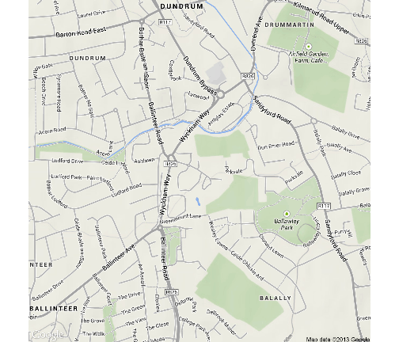
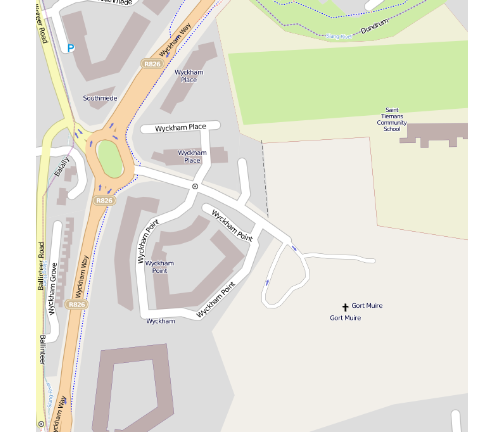
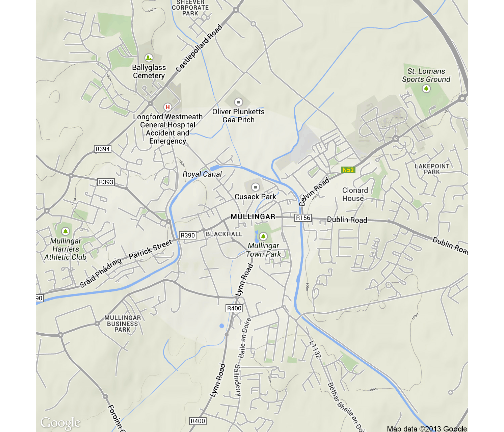
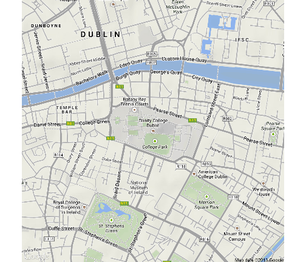
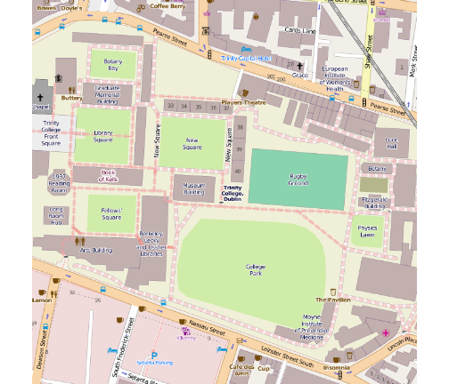
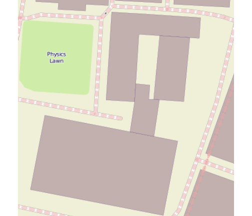
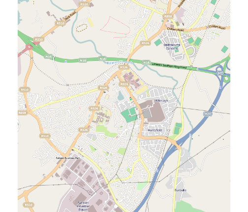

ggmap example
=====================================


```r
library(ggmap)
```

```
## Loading required package: ggplot2
```


```r
qmap("Wyckham place", zoom = 15)
```

```
## Map from URL : http://maps.googleapis.com/maps/api/staticmap?center=Wyckham+place&zoom=15&size=%20640x640&scale=%202&maptype=terrain&sensor=false
## Google Maps API Terms of Service : http://developers.google.com/maps/terms
## Information from URL : http://maps.googleapis.com/maps/api/geocode/json?address=Wyckham+place&sensor=false
## Google Maps API Terms of Service : http://developers.google.com/maps/terms
```

 


```r
qmap("Wyckham place", zoom = 17, source = "osm")
```

```
## Map from URL : http://maps.googleapis.com/maps/api/staticmap?center=Wyckham+place&zoom=17&size=%20640x640&maptype=terrain&sensor=false
## Google Maps API Terms of Service : http://developers.google.com/maps/terms
## Information from URL : http://maps.googleapis.com/maps/api/geocode/json?address=Wyckham+place&sensor=false
## Google Maps API Terms of Service : http://developers.google.com/maps/terms
```

 


```r
mgar <- "Mullingar"
qmap(mgar, zoom = 14)
```

```
## Map from URL : http://maps.googleapis.com/maps/api/staticmap?center=Mullingar&zoom=14&size=%20640x640&scale=%202&maptype=terrain&sensor=false
## Google Maps API Terms of Service : http://developers.google.com/maps/terms
## Information from URL : http://maps.googleapis.com/maps/api/geocode/json?address=Mullingar&sensor=false
## Google Maps API Terms of Service : http://developers.google.com/maps/terms
```

 

### Open Source Map

```r
qmap(mgar, zoom = 14, source = "cloudmade")
```

```
## Error: an api key must be specified for cloudmade maps, see
## ?get_cloudmademap.
```

geocode("Trinity College Dublin")
         lon      lat
 1 -6.254759 53.34375


```r
TCD <- "Trinity College Dublin"
qmap(TCD, zoom = 15)
```

```
## Map from URL : http://maps.googleapis.com/maps/api/staticmap?center=Trinity+College+Dublin&zoom=15&size=%20640x640&scale=%202&maptype=terrain&sensor=false
## Google Maps API Terms of Service : http://developers.google.com/maps/terms
## Information from URL : http://maps.googleapis.com/maps/api/geocode/json?address=Trinity+College+Dublin&sensor=false
## Google Maps API Terms of Service : http://developers.google.com/maps/terms
```

 

Zooming In

```r
qmap(TCD, zoom = 17, source = "osm")
```

```
## Map from URL : http://maps.googleapis.com/maps/api/staticmap?center=Trinity+College+Dublin&zoom=17&size=%20640x640&maptype=terrain&sensor=false
## Google Maps API Terms of Service : http://developers.google.com/maps/terms
## Information from URL : http://maps.googleapis.com/maps/api/geocode/json?address=Trinity+College+Dublin&sensor=false
## Google Maps API Terms of Service : http://developers.google.com/maps/terms
```

 

```r
# Lincoln Place
```

TCD Zoology

```r
qmap(c(-6.251659, 53.34309), zoom = 19, source = "osm")
```

```
## Map from URL : http://maps.googleapis.com/maps/api/staticmap?center=53.34309,-6.251659&zoom=19&size=%20640x640&maptype=terrain&sensor=false
## Google Maps API Terms of Service : http://developers.google.com/maps/terms
```

 

###  Dooradoyle Limerick

```r
ddoyle <- "Dooradoyle"
qmap(ddoyle, zoom = 14, source = "osm")
```

```
## Map from URL : http://maps.googleapis.com/maps/api/staticmap?center=Dooradoyle&zoom=14&size=%20640x640&maptype=terrain&sensor=false
## Google Maps API Terms of Service : http://developers.google.com/maps/terms
## Information from URL : http://maps.googleapis.com/maps/api/geocode/json?address=Dooradoyle&sensor=false
## Google Maps API Terms of Service : http://developers.google.com/maps/terms
```

 

### Cloud made maps

```r
qmap("Dublin", zoom = 15, source = "cloudmade")
```

```
## Error: an api key must be specified for cloudmade maps, see
## ?get_cloudmademap.
```


